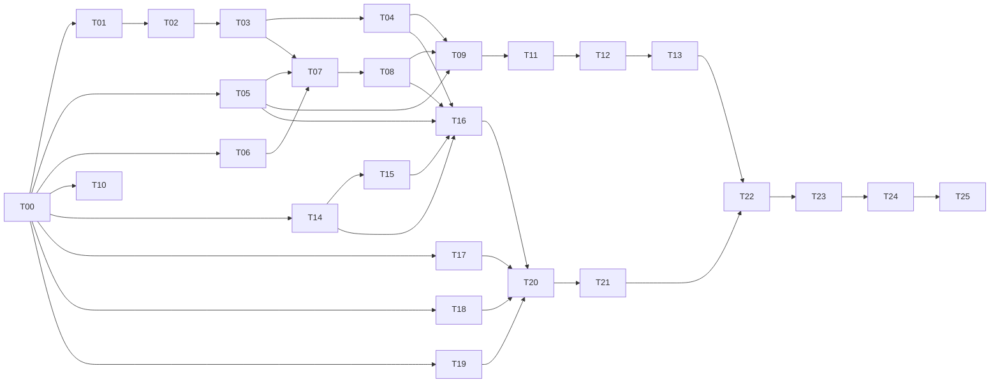

# PLAN.md — Task breakdown for the secure 2-VPS web app POC

_Version 1.1, 2026-09-15. Derived from the 24 accepted decisions in [`docs/adr/`](docs/adr/README.md). Hostname: **`test-vinayak.duckdns.org`**. Repository: `akshatauppinventure/web-app-test`. Task status is tracked in `CLAUDE.md`._

## How to read this plan

- **Tasks are in dependency order** and grouped into phases. Within a phase, tasks marked ∥ can run in parallel.
- **Sizes:** **S** ≈ 1–2 hours · **M** ≈ half a day · **L** ≈ one full session. No task is bigger than one session; anything larger was split.
- **Each task lists:** ADRs it implements, tasks it depends on, files it touches, its tests, a definition of done, and whether it needs an **owner action** (an account, a token, a purchase or a manual step only you can do).
- **One PR per task**, branch `task/T##-short-name`. A task is done only when its PR is merged with CI green.
- Placeholders used below: `akshatauppinventure` = `akshatauppinventure` (repo `web-app-test`); `<poc-host>` = `test-vinayak.duckdns.org`.

### Global definition of done (applies to every task)

1. CI is green (from T11 onward). Before T11: the task's listed local checks pass.
2. No secret, token or private key is committed (gitleaks clean; `.gitignore` covers local secret files).
3. The PR description names the ADR(s) the task implements and any deviation from them.
4. Docs touched by the task are updated in the same PR (README, runbooks, ADR follow-ups).
5. New images/versions follow the pinning rules in ADR-0020 (exact version + digest, no `latest`).

### Two deviations from the ADRs, for your review

1. **Portainer is bootstrapped outside the GitOps stacks (T17/T21).** Portainer cannot deploy the stack that contains itself. So Portainer Server (VPS-B) and Agent (VPS-A) are started by cloud-init from a small `bootstrap` compose project, not from `infra/stacks/*`. The GitOps stacks contain only application and edge services. ADR-0006 gets a one-line amendment in T00.
2. **Traefik upstream addresses come from environment variables** (T14), so the same dynamic config works in the local test (`keycloak` container) and in production (`10.10.0.2`). No security impact; noted for transparency.
3. **PostgreSQL and CrowdSec get small custom images** (T16: `infra/postgres/Dockerfile`, `infra/crowdsec/Dockerfile`) that bake in the initdb scripts / configuration files. Portainer CE cannot bind-mount repository-relative files from a Git stack (a Business Edition feature), so every configuration file the stacks need is inside an image built and signed by CI. T12's build matrix therefore covers six components: frontend, backend, keycloak, traefik, crowdsec, postgres.

---

## Owner prerequisites (things only you can do)

Detailed click-by-click steps for every item, with verification commands, are in [`docs/runbooks/owner-prerequisites.md`](docs/runbooks/owner-prerequisites.md).

| # | Needed by | Action | Where the result goes |
|---|---|---|---|
| P1 | T00 | Create a **private GitHub repository** `akshatauppinventure/web-app-test` (empty) | Remote for the repo |
| P2 | T09 | **Google Cloud project** + OAuth consent screen (External, Testing, add yourself as test user) + **OAuth client "local"** with redirect URI `http://localhost:8080/auth/realms/app/broker/google/endpoint` | Local dev secrets (never committed) |
| P3 | T12 | Confirm GitHub **Packages** visibility settings (private) for the repo | GHCR |
| P4 | T13 | Create a **GitHub App** (permissions: contents RW, pull requests RW, metadata R) and install it on the repo; store App ID + private key as repo secrets `DEPLOY_APP_ID`, `DEPLOY_APP_KEY` | Deploy-PR bot |
| P5 | T19 | Generate your **admin age key** (`age-keygen`), keep it in your password manager + an offline copy | `.sops.yaml` public key |
| P6 | T18 | **UpCloud account**, payment method, an **API token** (server + network + storage permissions) | Local env var for OpenTofu (never committed) |
| P7 | T20 | Install **WireGuard** on your laptop; generate its key pair | Admin peer in `peers.yaml` (public key only) |
| P8 | T22 | DuckDNS: point `test-vinayak.duckdns.org` at VPS-A's public IPv4 (after T20). Account has MFA. | DNS |
| P9 | T22 | Google **OAuth client "poc"** with redirect URI `https://test-vinayak.duckdns.org/auth/realms/app/broker/google/endpoint` | Core secrets |
| P10 | T23 | Create **UpCloud Managed Object Storage** (region US-1) bucket + access key scoped to it | Core secrets |
| P11 | T24 | (Optional) free external uptime monitor account | ADR-0024 |
| P12 | T00 | **Decide:** upgrade to GitHub Pro so the `main` ruleset can be enforced on the private repo, or accept process-only protection for the POC (see `docs/runbooks/github-settings.md`) | Repo ruleset |
| P13 | T10 | Install the **Renovate GitHub App** on the repository (steps in `docs/runbooks/github-settings.md` §4) | Dependency PRs |
| P14 | T11 | Grant the `gh` CLI token the **`workflow`** scope (`gh auth refresh -h github.com -s workflow`) so `.github/workflows/*` can be pushed | CI workflow PR |

Not needed for the POC: a domain, Apple Developer Program, Cloudflare.

---

## Dependency graph

Phases 1 (app), 2 (CI) and 3 (infra) are largely independent of each other after T00, so they can be interleaved. Phase 4 needs cloud accounts and is where costs start.

---

## Phase 0 — Repository bootstrap

### T00 · Repo skeleton, accept ADRs, first commit — **S**

- **ADRs:** 0001, 0006 (amendment), 0017
- **Depends on:** P1
- **Files:** `.gitignore`, `.editorconfig`, `README.md` (project overview, links to ADRs and PLAN), `CODEOWNERS` (`/infra/`, `/.github/`, `/docs/adr/`), `.github/PULL_REQUEST_TEMPLATE.md` (ADR checklist), `Makefile` (target stubs), `docs/runbooks/README.md`, `docs/verification/README.md`, `docs/adr/*.md` (status → Accepted; ADR-0006 amendment: "Portainer is bootstrapped by cloud-init as a separate compose project"), `docs/adr/README.md` (index statuses), `PLAN.md` (this file, moved under version control).
- **Tests:** none (docs/config only). `git log` shows one clean initial commit.
- **Done when:** repo initialized on `main`, pushed to `akshatauppinventure/web-app-test`; all 24 ADRs read `Status: Accepted`; branch ruleset on `main` enabled (PR required, no force push) per ADR-0017; secret scanning + push protection on.
- **Owner action:** P1, then enable repo settings (runbook written in this task: `docs/runbooks/github-settings.md`).

---

## Phase 1 — Local hello-world application (no cloud needed)

### T01 · Backend scaffold (FastAPI + uv + tooling) — **S**

- **ADRs:** 0008
- **Depends on:** T00
- **Files:** `backend/pyproject.toml` (deps: fastapi, uvicorn, pydantic-settings, structlog or std logging JSON; dev: pytest, pytest-asyncio, httpx, ruff, pyright), `backend/uv.lock`, `backend/app/__init__.py`, `backend/app/main.py` (app factory; docs disabled unless `ENVIRONMENT=local`), `backend/app/config.py` (pydantic-settings, `secrets_dir=/run/secrets`), `backend/app/logging.py`, `backend/app/api/health.py` (`/healthz`, `/readyz` stub), `backend/tests/test_health.py`, `backend/tests/conftest.py`.
- **Tests:** `test_health.py` (200 on `/healthz`; `/docs` returns 404 when `ENVIRONMENT=poc`).
- **Done when:** `uv sync --locked`, `ruff check`, `ruff format --check`, `pyright`, `pytest` all pass locally; `uv run uvicorn app.main:app` serves `/healthz`.

### T02 · Database schema, roles, migrations, Row-Level Security — **M**

- **ADRs:** 0009, 0011
- **Depends on:** T01
- **Files:** `backend/alembic.ini`, `backend/alembic/env.py`, `backend/alembic/versions/0001_visits.py` (table `visits(owner_sub text pk, display_name text, last_visit timestamptz, visit_count int)`, `ENABLE`+`FORCE ROW LEVEL SECURITY`, policies on `current_setting('app.user_id', true)`, grants to `app_rw`), `infra/postgres/initdb/01-roles.sh` (creates roles `app_owner`, `app_migrator`, `app_rw`, `keycloak` and DBs `app`, `keycloak` from `*_PASSWORD_FILE`; revokes on PUBLIC), `infra/postgres/initdb/02-hardening.sql`, `infra/postgres/postgresql.conf` (scram, logging, timeouts), `backend/app/db.py` (async engine, session dependency, `set_config('app.user_id', ..., true)` per transaction), `backend/tests/test_rls.py`, `backend/tests/db_fixtures.py`, `compose.test.yaml` (postgres:18.6 for tests).
- **Tests:** with `DATABASE_URL` set (Postgres from `compose.test.yaml`): migration applies on an empty DB; as `app_rw`: user A cannot read/update user B's row; no context → 0 rows; `app_rw` cannot `SET ROLE app_owner` or bypass RLS; tests are skipped (not failed) when no DB is available.
- **Done when:** `alembic upgrade head` and `downgrade base` both succeed; RLS suite passes against Postgres 18.6.

### T03 · JWT validation and hello endpoints — **M**

- **ADRs:** 0011, 0008
- **Depends on:** T02
- **Files:** `backend/app/auth/jwks.py` (cached JWKS client, refresh on unknown `kid`, ≤1/60 s), `backend/app/auth/deps.py` (`current_user`, `require_roles`; checks alg allowlist, `iss`, `aud=api`, `azp=web-bff`, `exp/nbf/iat` 30 s leeway, `typ`, `sub`), `backend/app/api/v1/me.py`, `backend/app/api/v1/hello.py`, `backend/app/models/visit.py`, `backend/app/services/visits.py` (upsert scoped to `sub`), `backend/tests/test_auth.py`, `backend/tests/test_hello.py`, `backend/tests/keys.py` (test RSA key pair + fake JWKS via respx).
- **Tests:** positive path; negative: wrong `iss`, wrong `aud`, wrong `azp`, `alg=none`, `alg=HS256` with public key as secret, expired, tampered signature, unknown `kid` triggers one refresh then 401; `/v1/hello` increments `visit_count` and only for the caller's `sub`.
- **Done when:** all tests pass; `GET /v1/hello` returns `{"message": "Hello, <name> — last visit <ts>", "visit_count": n}`.

### T04 · Backend container image — **S**

- **ADRs:** 0008, 0005, 0020
- **Depends on:** T03
- **Files:** `backend/Dockerfile` (multi-stage; builder installs venv with uv; runtime `python:3.14-slim-trixie@sha256:…`, non-root UID 10001, no uv in final image), `backend/.dockerignore`, `.hadolint.yaml`, `Makefile` targets `backend-image`, `backend-image-test`.
- **Tests:** `hadolint backend/Dockerfile`; `docker run --rm --read-only --cap-drop ALL --security-opt no-new-privileges … id -u` prints `10001`; container answers `/healthz` with a read-only root FS; `docker image inspect` shows OCI labels.
- **Done when:** image builds reproducibly, size recorded in PR, all checks above pass.

### T05 · Keycloak custom image and `app` realm — **L**

- **ADRs:** 0010, 0011
- **Depends on:** T00
- **Files:** `infra/keycloak/Dockerfile` (from `quay.io/keycloak/keycloak:26.7.2@sha256:…`; downloads klausbetz Apple extension JAR at pinned version, verifies against `checksums.txt`; `kc.sh build --db=postgres --http-relative-path=/auth --health-enabled=true --metrics-enabled=true`), `infra/keycloak/checksums.txt`, `infra/keycloak/realms/app-realm.json` (realm `app`: registration on, brute-force on, password policy, WebAuthn optional; roles `user`, `admin`; default role `user`; client `web-bff` confidential + PKCE S256 + audience mapper `api`; client `api` bearer-only; token lifetimes 5 min / rotating refresh / SSO idle 30 min, max 10 h; IdP `google` enabled with `${GOOGLE_CLIENT_ID}`/`${GOOGLE_CLIENT_SECRET}` placeholders; IdP `apple` present, **disabled**; first-broker-login flow requires verified email; events enabled 7 days), `infra/keycloak/scripts/smoke.sh` (discovery doc, JWKS, admin API lists `apple` in `identity-provider/providers`, test user login via a `ci-smoke` direct-grant client that exists only in the CI realm overlay `app-realm.ci.json`), `infra/keycloak/README.md` (realm export/import runbook).
- **Tests:** `hadolint`; image builds; `smoke.sh` passes against the image + a throwaway Postgres 18.6 (run in `compose.test.yaml`).
- **Done when:** `https://…/auth/realms/app/.well-known/openid-configuration` served; access token for the test user contains `aud: api`, `azp: web-bff`, `realm_access.roles: [user]`; admin console reachable only at `/auth/admin` (route restriction itself is Traefik's job, T14).

### T06 · Frontend scaffold (Next.js 16.3 + pnpm + tooling) — **S**

- **ADRs:** 0007
- **Depends on:** T00
- **Files:** `frontend/package.json` (`packageManager: pnpm@<exact>`, `next@16.3.x`, `react@19.2.x`; scripts lint/typecheck/test/build), `frontend/pnpm-lock.yaml`, `frontend/.npmrc` (`only-built-dependencies` allowlist), `frontend/next.config.ts` (`output: 'standalone'`, `poweredByHeader: false`, `images: { remotePatterns: [], formats: ['image/webp'], dangerouslyAllowSVG: false }`), `frontend/tsconfig.json` (strict), `frontend/eslint.config.mjs`, `frontend/vitest.config.ts`, `frontend/app/layout.tsx`, `frontend/app/page.tsx` (landing + sign-in buttons placeholder), `frontend/app/hello/page.tsx` (placeholder), `frontend/app/api/healthz/route.ts`, `frontend/scripts/check-next-version.mjs` (fails if `next < 16.3.3`), `frontend/tests/version-guard.test.ts`.
- **Tests:** `pnpm lint`, `pnpm typecheck`, `pnpm test`, `pnpm build`; version guard test.
- **Done when:** all four scripts pass; `pnpm build` produces `.next/standalone`.

### T07 · Frontend authentication (Auth.js v5 BFF) and `/hello` — **L**

- **ADRs:** 0011, 0007, 0010
- **Depends on:** T06, T05, T03
- **Files:** `frontend/auth.ts` (Auth.js config: Keycloak provider, PKCE, JWT session strategy, `jwt` callback with server-side refresh at ≤60 s to expiry, `__Secure-` cookies in prod), `frontend/app/api/auth/[...nextauth]/route.ts`, `frontend/lib/api-client.ts` (`import 'server-only'`; calls `API_BASE_URL` with Bearer token), `frontend/lib/session.ts`, `frontend/components/sign-in-buttons.tsx` (Google button → `signIn('keycloak', …, { kc_idp_hint: 'google' })`; Apple button hidden behind `NEXT_PUBLIC_APPLE_LOGIN=false`), `frontend/app/hello/page.tsx` (server component; calls `/v1/hello`), `frontend/app/api/logout/route.ts` (RP-initiated logout with `id_token_hint`), `frontend/proxy.ts`/`middleware.ts` (redirect-only, no authz), `frontend/tests/auth-refresh.test.ts`, `frontend/tests/api-client.test.ts`, `frontend/.env.example`.
- **Tests:** vitest: refresh triggered when `expires_at - now < 60`, session invalidated on refresh failure, api-client sets Bearer and never runs client-side; manual end-to-end in T09.
- **Done when:** unit tests pass; sign-in → Keycloak → back → `/hello` renders the API message; sign-out clears the cookie and ends the Keycloak session; no token is readable from `document.cookie` or client JS.

### T08 · Frontend container image — **S**

- **ADRs:** 0007, 0005, 0020
- **Depends on:** T07
- **Files:** `frontend/Dockerfile` (multi-stage on `node:24-alpine@sha256:…`; copies `.next/standalone`, `.next/static`, `public`; `USER node`; `tmpfs` for `.next/cache`), `frontend/.dockerignore`, `Makefile` targets.
- **Tests:** `hadolint`; runs read-only + `cap_drop ALL` as UID 1000; `/api/healthz` responds; image size recorded.
- **Done when:** same criteria as T04.

### T09 · Local full stack (`compose.dev.yaml`) and developer docs — **M**

- **ADRs:** 0005, 0009, 0010, 0011, 0016 (dev variant), 0022 (local Google client)
- **Depends on:** T04, T05, T08, P2
- **Files:** `compose.dev.yaml` (postgres 18.6 with initdb scripts, keycloak (T05 image, `KC_HOSTNAME=http://localhost:8080/auth`), `migrate` one-shot, backend, frontend; dev secrets from `.dev-secrets/` (gitignored)), `scripts/dev/gen-dev-secrets.sh`, `.env.example`, `docs/dev-setup.md` (incl. creating the local Google OAuth client), `Makefile` (`dev-up`, `dev-down`, `dev-logs`, `dev-reset`).
- **Tests:** `docker compose -f compose.dev.yaml config`; scripted smoke `scripts/dev/smoke.sh` (waits for health, hits `/healthz`, discovery doc, frontend `/`).
- **Done when:** `make dev-up` from a clean clone → sign in with a local Keycloak user **and** with Google (local client) at `http://localhost:3000` → `/hello` shows the visit row; second visit increments the count.

---

## Phase 2 — CI/CD

### T10 · Renovate and repo policy files — **S** ∥

- **ADRs:** 0020, 0019, 0017
- **Depends on:** T00
- **Files:** `renovate.json` (docker digests, compose, pnpm, uv, GitHub Actions SHAs, custom regex managers for Keycloak Apple extension + Traefik plugin versions/checksums; `minimumReleaseAge: 3 days` except security; weekly groups; majors separate), `docs/runbooks/github-settings.md` (extend: Renovate app install, Dependabot alerts on, private packages).
- **Tests:** `renovate-config-validator` locally (via `npx`) and in CI (T11).
- **Done when:** Renovate is installed on the repo and its onboarding/dashboard issue lists the expected managers.

### T11 · `ci.yml` (lint, test, policy checks) — **M**

- **ADRs:** 0017, 0019, 0014 (port allowlist), 0007 (version floor)
- **Depends on:** T09, T10
- **Files:** `.github/workflows/ci.yml` (jobs: `backend`, `frontend`, `infra`, `shared`; path filters; `permissions: contents: read`; `persist-credentials: false`; all actions SHA-pinned with version comments; concurrency group), `infra/policy/published-ports.txt` (allowlist from ADR-0014), `scripts/ci/check-published-ports.sh`, `scripts/ci/check-compose.sh` (`docker compose config` for every compose file), `.gitleaks.toml`, `zizmor.yml`, `.github/dependency-review-config.yml`.
- **Tests:** the workflow itself is the test: open a PR that (a) adds an unlisted `ports:` entry → fails; (b) downgrades `next` → fails; (c) commits a fake secret → fails; then revert.
- **Done when:** CI green on `main`; `zizmor` reports 0 findings; the three negative PRs failed as intended (screenshots/links in the PR).

### T12 · `build-publish.yml` (build, scan, push, attest, sign) — **M**

- **ADRs:** 0017, 0019, 0020
- **Depends on:** T11, P3
- **Files:** `.github/workflows/build-publish.yml` (matrix over changed components `frontend`, `backend`, `traefik`, `keycloak` (traefik requires T14; matrix entry added then); buildx `linux/amd64`, GHA cache; Trivy (SHA-pinned action or pinned binary) gate `CRITICAL,HIGH` + `--ignore-unfixed`; push `ghcr.io/akshatauppinventure/<component>:sha-<sha>`; `sbom: true`, `provenance: mode=max`; cosign keyless sign; job `permissions: packages: write, id-token: write`), `.trivyignore` (header + expiry convention), `docs/runbooks/ci-images.md`.
- **Tests:** after merge: `docker buildx imagetools inspect … --format '{{json .Provenance}}'` shows provenance + SBOM; `cosign verify --certificate-identity-regexp '…/build-publish.yml@refs/heads/main' --certificate-oidc-issuer https://token.actions.githubusercontent.com ghcr.io/…@sha256:…` succeeds; a deliberately vulnerable base image in a test PR fails the gate.
- **Done when:** frontend, backend and keycloak images exist in private GHCR with attestations and signatures.

### T13 · Deploy-PR bot and digest verification check — **M**

- **ADRs:** 0018, 0019
- **Depends on:** T12, T16, P4
- **Files:** `scripts/ci/bump-digest.py` (rewrites `image:` lines in `infra/stacks/*/compose.yaml` for one component), `.github/workflows/build-publish.yml` (final job: `actions/create-github-app-token` → branch `deploy/<component>-<sha>` → PR `deploy(<component>): sha-<sha>` → enable auto-merge), `.github/workflows/verify-deploy.yml` (on PRs touching `infra/stacks/**`: `cosign verify` every `ghcr.io` digest referenced; runs port allowlist + compose checks), `docs/runbooks/deploy-and-rollback.md` (auto-merge in POC, revert procedure).
- **Tests:** merge a trivial backend change → a deploy PR opens, `verify-deploy` passes, auto-merges; open a manual PR referencing an unsigned digest → `verify-deploy` fails.
- **Done when:** both scenarios observed and linked in the PR.

---

## Phase 3 — Infrastructure images, stacks and host configuration

### T14 · Traefik image, static and dynamic configuration — **M** ∥

- **ADRs:** 0012, 0013 (plugin loading), 0022
- **Depends on:** T00 (local test also uses T05/T08 images)
- **Files:** `infra/traefik/Dockerfile` (from `traefik:v3.7.13@sha256:…`; copies pre-downloaded plugin sources into `/plugins-local/`), `infra/traefik/plugins.lock` (module, version, sha256), `infra/traefik/scripts/fetch-plugins.sh` (used in CI build; verifies checksums), `infra/traefik/traefik.yml` (entry points 80→443 redirect except ACME, `websecure`, file provider, ACME HTTP-01 resolver `le` with `caServer` switchable to staging, `api` off, JSON access log with dropped auth/cookie headers, `ping`, `experimental.localPlugins`), `infra/traefik/dynamic/tls.yml` (TLS 1.2+, `sniStrict`, default self-signed cert for unknown hosts), `infra/traefik/dynamic/middlewares.yml` (`secure-headers`, `ratelimit-app`, `ratelimit-auth`, `body-limit`, `inflight`, `crowdsec`, `compress`), `infra/traefik/dynamic/routes.yml` (routers `frontend`, `keycloak-public`, `keycloak-block` (404), catch-all 404; upstreams from `{{ env "KEYCLOAK_UPSTREAM" }}` / `{{ env "FRONTEND_UPSTREAM" }}`), `compose.traefik-test.yaml`, `scripts/test/traefik-routes.sh`, `infra/traefik/README.md`.
- **Tests:** `hadolint`; local compose with `Host: test-vinayak.duckdns.org` header: `/` → 200 from frontend; `/auth/realms/app/.well-known/openid-configuration` → 200; `/auth/admin` → 404; `/auth/admin/master/console` → 404; unknown Host → 404; response headers include HSTS, `X-Content-Type-Options`, `Referrer-Policy`, `Permissions-Policy`, no `Server`; 2 MiB POST → 413; burst of 200 requests → some 429.
- **Done when:** `traefik-routes.sh` passes; `build-publish.yml` matrix includes `traefik` (image signed in GHCR).

### T15 · CrowdSec engine, bouncer wiring, AppSec (detection-only) — **M**

- **ADRs:** 0013
- **Depends on:** T14
- **Files:** `infra/crowdsec/acquis.yaml` (Traefik access log, host `auth.log`), `infra/crowdsec/config/profiles.yaml` (4 h bans, escalation), `infra/crowdsec/config/allowlist.yaml` (`10.10.0.0/24`), `infra/crowdsec/appsec/` (virtual-patching + generic rules, `on_match: log` for phase 1), `infra/crowdsec/collections.txt`, `infra/crowdsec/scripts/bootstrap-bouncer.sh` (registers Traefik bouncer, writes key to the secrets dir), `infra/traefik/dynamic/middlewares.yml` (crowdsec plugin config: stream mode, AppSec URL, fail-open for POC), `compose.traefik-test.yaml` (add crowdsec), `scripts/test/crowdsec.sh`.
- **Tests:** `cscli bouncers list` shows `traefik`; `cscli collections list` shows the six collections; `cscli decisions add --ip 203.0.113.9` → request with `X-Forwarded-For` from that IP (trusted in test only) gets 403; a `/etc/passwd` traversal request produces an AppSec **log** entry but a 200/404, not a block; stop CrowdSec → traffic still flows (fail-open) and Traefik logs a warning.
- **Done when:** `crowdsec.sh` passes; console enrollment documented in `infra/crowdsec/README.md` (enrollment key stays a secret).

### T16 · GitOps stack compose files (`edge`, `core`) — **M**

- **ADRs:** 0003, 0005, 0006, 0009, 0010, 0012, 0013, 0014, 0016, 0018
- **Depends on:** T04, T05, T08, T14, T15
- **Files:** `infra/stacks/edge/compose.yaml` (traefik `0.0.0.0:80/443`, crowdsec, frontend; networks `edge`; secrets from `/etc/app/secrets/*`; every service: non-root, `read_only`, `tmpfs`, `cap_drop ALL`, `no-new-privileges`, limits, `pids_limit`, healthcheck, `restart: unless-stopped`), `infra/stacks/core/compose.yaml` (postgres (no ports, network `db` internal), `migrate`, backend `10.10.0.2:8000`, keycloak `10.10.0.2:8080`; networks `db` internal + `core`), `infra/stacks/README.md` (env vars Portainer must set: none secret; image digests are placeholders until T13 fills them), `infra/policy/published-ports.txt` (finalize).
- **Tests:** `docker compose config` for both; `check-published-ports.sh`; `scripts/ci/check-hardening.py` (asserts every service has `user`, `read_only`, `cap_drop`, `security_opt`, `healthcheck`, memory limit; whitelist with justification for Traefik `NET_BIND_SERVICE`); local dry run: `docker compose -f infra/stacks/core/compose.yaml up` with WireGuard IPs overridden to `127.0.0.1` via env.
- **Done when:** both stacks validate and start locally with overrides; hardening check passes.

### T17 · Host configuration: cloud-init, nftables, WireGuard, Docker daemon, timers — **L** ∥

- **ADRs:** 0004, 0005, 0006 (bootstrap), 0014, 0015, 0021, 0024
- **Depends on:** T00
- **Files:** `infra/host/cloud-init/edge.yaml.tmpl`, `infra/host/cloud-init/core.yaml.tmpl` (admin user + SSH key, packages, Docker apt repo, sysctl, sshd hardening drop-in, unattended-upgrades, timezone/NTP, write files below, enable units), `infra/host/nftables/edge.nft`, `infra/host/nftables/core.nft` (input policy DROP per ADR-0014; IPv6 DROP), `infra/host/docker/daemon.json`, `infra/host/scripts/docker-user-rules.sh` (+ `infra/host/systemd/docker-user-rules.service`, ordered after docker), `infra/host/wireguard/wg0-edge.conf.tmpl`, `infra/host/wireguard/wg0-core.conf.tmpl`, `infra/host/wireguard/peers.yaml` (public keys only), `infra/host/systemd/docker.service.d/wireguard.conf` (`After=wg-quick@wg0.service`), `infra/host/bootstrap/portainer-server.compose.yaml` (B: `10.10.0.2:9443`, `AGENT_SECRET` from secret file), `infra/host/bootstrap/portainer-agent.compose.yaml` (A: `10.10.0.1:9001`), `infra/host/scripts/healthcheck.sh` + timer (containers healthy, WG handshake < 3 min, disk < 80 %, backup age < 26 h, cert expiry > 14 d; notifies via configurable webhook), `infra/host/scripts/pg-backup.sh` + `pg-backup.timer` (B only; `pg_dump` → `restic backup --stdin`; `forget/prune`; weekly `check`), `infra/host/scripts/restore-drill.sh`, `infra/host/README.md`.
- **Tests:** `shellcheck` on all scripts; `nft -c -f` for both rulesets inside an `ubuntu:26.04` container; `cloud-init schema --config-file` on rendered templates; `wg-quick strip` parses the rendered configs; unit test for `docker-user-rules.sh` in a privileged test container (rules present after `docker` restart).
- **Done when:** all static checks pass in CI (`infra` job extended); rendered cloud-init for a fake host is reviewed line by line in the PR.

### T18 · OpenTofu module for UpCloud — **M** ∥

- **ADRs:** 0002, 0014, 0015
- **Depends on:** T00, T17 (templates), P6
- **Files:** `infra/tofu/upcloud/{versions.tf, providers.tf, variables.tf, main.tf, network.tf, firewall.tf, outputs.tf}` (2 servers in `us-nyc1`, Ubuntu 26.04 template, SDN private network + router, cloud-init from T17 templates, firewall rules per ADR-0014 layer 1 (stateful SDN rules; include explicit return-traffic rules if only classic rules are available), tags), `infra/tofu/upcloud/terraform.tfvars.example`, `infra/tofu/README.md` (state kept local + encrypted with SOPS for POC; API token via env), `.gitignore` (state files).
- **Tests:** `tofu fmt -check`, `tofu validate` (CI, no credentials), `tofu plan` locally with P6 (plan output pasted into PR, secrets redacted); a `tflint`/`trivy config` scan of the module.
- **Done when:** plan shows exactly: 2 servers, 1 private network, 1 router, firewall rulesets matching ADR-0014, no public IPv6, and nothing else.

### T19 · Secrets tooling (SOPS + age) — **S** ∥

- **ADRs:** 0016
- **Depends on:** T00, P5
- **Files:** `.sops.yaml` (creation rules: `infra/secrets/edge.sops.yaml`, `infra/secrets/core.sops.yaml`, tofu state; admin age recipients), `infra/secrets/edge.sops.yaml`, `infra/secrets/core.sops.yaml` (encrypted; placeholder values), `infra/secrets/SCHEMA.md` (every secret name, which host, which service consumes it, rotation period), `scripts/secrets/gen-secrets.sh` (generates strong random values for all generated secrets), `scripts/secrets/secrets-push.sh` (`sops -d` → `ssh` over WireGuard → `/etc/app/secrets/<name>` with owner/mode; never echoes), `docs/runbooks/secrets.md` (rotation, adding a secret, recovery copy).
- **Tests:** CI job: create throwaway age key, run `gen-secrets.sh` into a temp file, encrypt/decrypt round-trip, `shellcheck`; `secrets-push.sh --dry-run` prints target paths and modes only.
- **Done when:** the two encrypted files decrypt for the owner's key; SCHEMA lists all secrets referenced by T16 stacks and T17 bootstrap (a CI check cross-references names).

---

## Phase 4 — Provision and deploy (cloud costs start here)

### T20 · Provision both VPS, WireGuard, host hardening baseline — **L**

- **ADRs:** 0002, 0004, 0014, 0015
- **Depends on:** T16, T17, T18, T19, P6, P7
- **Files:** `infra/host/wireguard/peers.yaml` (real public keys), `infra/tofu/upcloud/terraform.tfvars` (SOPS-encrypted), `docs/runbooks/provisioning.md`, `docs/verification/host-baseline.md` (Lynis index, docker-bench summary, `nft list ruleset` excerpts, `ss -tulpn` output).
- **Tests (live):** from the laptop over WireGuard: SSH to `10.10.0.1` and `10.10.0.2` works; SSH to public IPs is refused/timeouts; `wg show` on A shows a B handshake < 2 min; `apt update` and `docker pull hello-world` succeed (stateless-firewall return traffic OK); `nmap -Pn -p- <A public>` → only 80/443 (nothing yet listening → filtered/closed, no others); `nmap -Pn -p- <B public>` → nothing open; Lynis and docker-bench run.
- **Done when:** both servers up from `tofu apply` without manual fixes; baselines recorded; any deviation fed back into T17 as a follow-up PR.
- **Owner action:** P6, P7, run `tofu apply` (billing starts).

### T21 · Portainer bootstrap and GitOps stack registration — **M**

- **ADRs:** 0006, 0018, 0016
- **Depends on:** T20, T13
- **Files:** `docs/runbooks/portainer.md` (initial admin over WireGuard, connect Agent, GHCR read-only credential, create `edge`/`core` Git stacks with 5-min polling + re-pull), `infra/secrets/*.sops.yaml` (real values incl. `AGENT_SECRET`, GHCR token stored **in Portainer only**, not on disk).
- **Tests (live):** `https://10.10.0.2:9443` reachable over WireGuard only; `https://<B public>:9443` unreachable; Agent shows "up" in Portainer; `secrets-push.sh` populated `/etc/app/secrets` with correct owners/modes on both hosts (audit script `scripts/secrets/audit-hosts.sh`); Portainer pulls the repo and shows both stacks (not yet healthy until T22 DNS/TLS).
- **Done when:** both stacks deployed by Portainer from `main`; `docker ps` on A shows only edge services + agent; on B only core services + Portainer.

### T22 · DNS, TLS, production Google client, first end-to-end deployment — **M**

- **ADRs:** 0022, 0012, 0010, 0011, 0018
- **Depends on:** T21, P8, P9
- **Files:** `infra/secrets/core.sops.yaml` (Google poc client), `infra/traefik/traefik.yml` (ACME production after one staging success; via env `ACME_CA_SERVER`), `docs/runbooks/first-deploy.md`, `docs/runbooks/keycloak-realm-export.md`.
- **Tests (live):** `dig +short test-vinayak.duckdns.org` = A's IP; Let's Encrypt staging cert issued, then production cert; `https://test-vinayak.duckdns.org/` loads; **Sign in with Google → `/hello` shows the visit message**; second login increments count; sign-out ends the session; `https://test-vinayak.duckdns.org/auth/admin` → 404; admin console works at `http://10.10.0.2:8080/auth/admin` over WireGuard with MFA enrolled for the admin; a code change merged to `main` reaches the site through the deploy PR + Portainer poll within ~10 min.
- **Done when:** all live tests pass; Keycloak master realm bootstrap admin deleted and replaced by a named MFA admin; realm exported back to git without secrets.
- **Owner action:** P8, P9, enroll admin MFA.

### T23 · Backups live and first restore drill — **S**

- **ADRs:** 0021
- **Depends on:** T22, P10
- **Files:** `infra/secrets/core.sops.yaml` (restic password, object-storage keys), `docs/runbooks/backup-restore.md`, `docs/runbooks/restore-drill-log.md` (first entry).
- **Tests (live):** `restic init` succeeds; `systemctl start pg-backup.service` creates a snapshot; `restic snapshots` lists it; `restore-drill.sh` restores into a scratch Postgres and row counts match; `restic check` passes; `healthcheck.sh` reports backup age OK; bucket versioning/lock status recorded.
- **Done when:** timer enabled; drill logged with date, snapshot ID, row counts, duration.
- **Owner action:** P10.

---

## Phase 5 — Verification and close-out

### T24 · Security verification and POC report — **L**

- **ADRs:** all; verification plan from the research (plan rev 2 §13)
- **Depends on:** T23, P11 (optional)
- **Files:** `scripts/verify/external-scan.sh` (nmap TCP+UDP, from outside), `scripts/verify/headers.sh`, `scripts/verify/blast-radius.sh` (run on A: grep secrets dir, env, volumes for DB/Keycloak/restic secrets → must find none; A can reach B only on 8080/8000), `scripts/verify/port-bypass-test.sh` (temporary `-p 0.0.0.0:8081:80` container must be unreachable externally), `scripts/verify/rls-cross-user.sh`, `docs/verification/poc-security-report.md`.
- **Tests (live):** nmap A → 80/443 only, UDP 51820 `open|filtered`; nmap B → nothing; SSL Labs A+; securityheaders.com A; OWASP ZAP baseline (Docker) → no High; brute-force 20 wrong passwords → Keycloak temporary lockout + CrowdSec decision within 60 s; user X cannot read user Y's row via API (403/empty) and via SQL as `app_rw`; blast-radius script clean; port-bypass test blocked; CrowdSec fail-open confirmed and documented; Lynis/docker-bench deltas vs T20.
- **Done when:** report committed with all results, evidence links, and a list of accepted risks (from ADR "Negative / risks" sections) confirmed still accurate.

### T25 · AppSec blocking mode, runbooks, close-out — **S**

- **ADRs:** 0013, 0016, 0018, 0020, 0021, 0006
- **Depends on:** T24 (and ≥2 weeks of AppSec logs)
- **Files:** `infra/crowdsec/appsec/*` (`on_match: block`; exclusions documented), `docs/runbooks/{rollback.md, secrets-rotation.md, keycloak-upgrade.md, break-glass.md, upgrade-portainer.md}`, `docs/adr/README.md` (follow-ups → GitHub issues), `PLAN.md` (mark complete; list production-readiness backlog).
- **Tests (live):** after switching to block: Google login, sign-out, `/hello` and admin console still work; a traversal request now gets 403; runbooks each have a "last tested" date.
- **Done when:** AppSec in blocking mode with zero false positives over 48 h; all runbooks tested once; production backlog issues opened (3-tier topology, PITR backups, Cloudflare, real domain + Apple login, observability stack, outbound filtering, DHI images, Vault/OpenBao evaluation).

---

## Summary

| Phase | Tasks | Sizes | Sessions (approx.) | Needs cloud spend |
|---|---|---|---|---|
| 0 Bootstrap | T00 | S | 0.5 | no |
| 1 Local app | T01–T09 | S S M M S L S L S → | 6 | no |
| 2 CI/CD | T10–T13 | S M M M | 3 | no |
| 3 Infra config | T14–T19 | M M M L M S | 5 | no |
| 4 Provision/deploy | T20–T23 | L M M S | 4 | **yes** (~$40–50/month + object storage) |
| 5 Verification | T24–T25 | L S | 2 | yes |
| **Total** | **26 tasks** | | **≈ 20 sessions** | |

**Suggested order for a single implementer:** T00 → T01 → T02 → T03 → T04 → T06 → T05 → T07 → T08 → T09 → T10 → T11 → T14 → T15 → T16 → T12 → T13 → T17 → T18 → T19 → T20 → T21 → T22 → T23 → T24 → T25.
(T12 after T14 so the Traefik image is in the first publish matrix; T05 before T07 so the realm exists for the frontend auth work.)

**What is explicitly out of scope for this plan:** Apple login enablement, custom domain, Cloudflare, 3-tier topology, PITR backups, full observability stack, Playwright end-to-end tests, custom Keycloak theme, SMTP/email verification. Each is listed as a follow-up in the relevant ADR and becomes a GitHub issue in T25.
